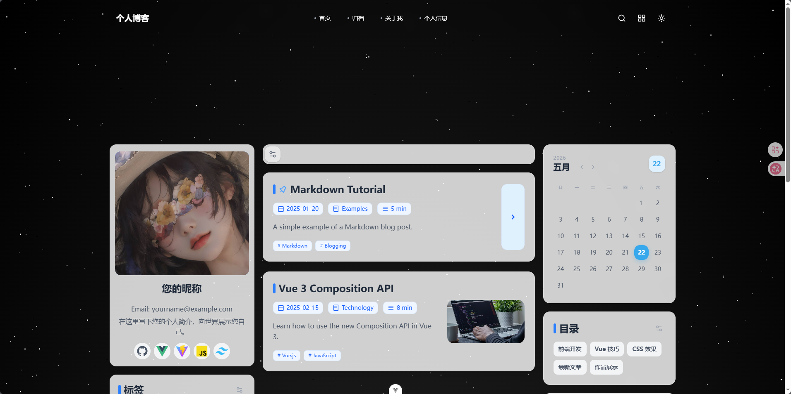
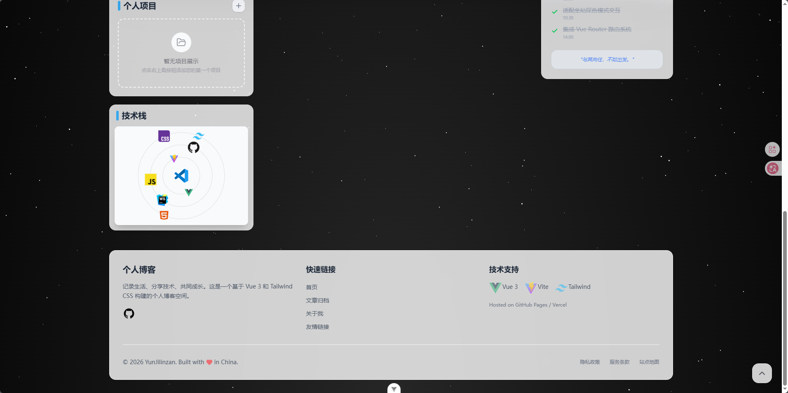
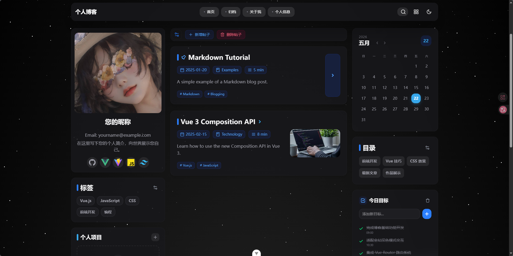
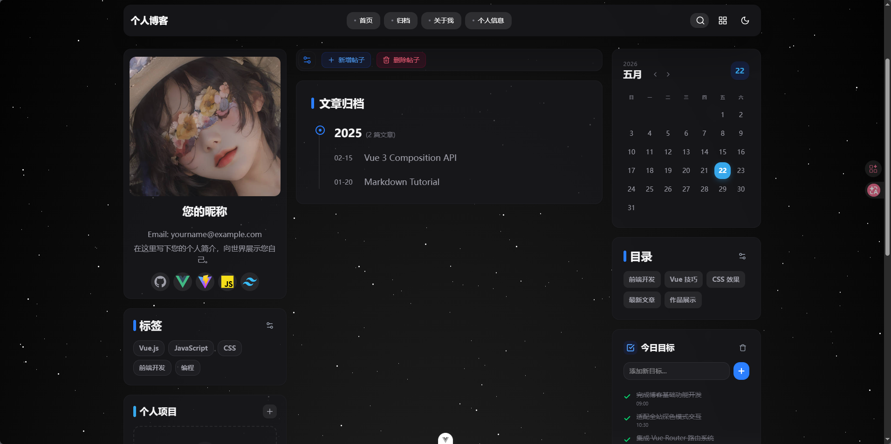
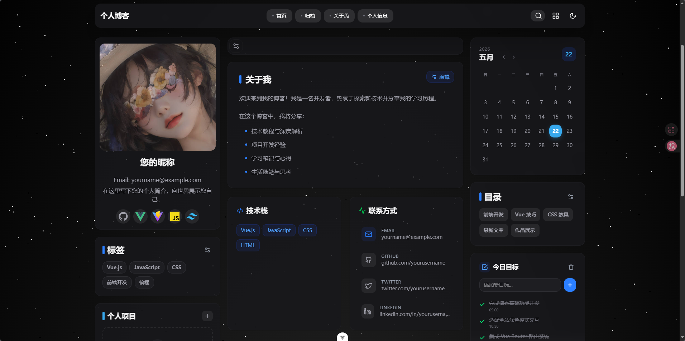
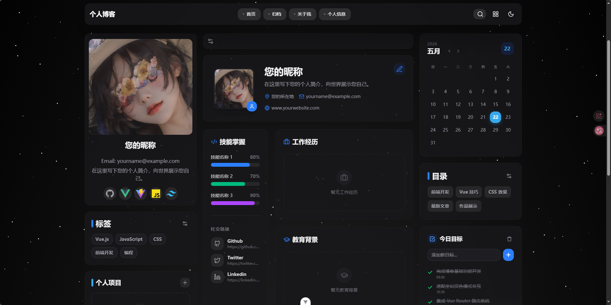

(This README was generated by an assistant. Edit as needed.)

**项目概览**

#### 项目效果

1.首页

 

2.帖子列表

3.归档

4.关于我

5.个人信息

6.移动端效果

这是一个基于 Vue 3、Vite 和 Pinia 的个人博客前端项目模板，提供文章展示、分页、归档、关于与个人资料管理等功能。

**技术栈**

- **框架**: Vue 3
- **构建工具**: Vite
- **状态管理**: Pinia
- **路由**: vue-router
- **样式/动画**: TailwindCSS、tw-animate-css、motion-v

**快速开始**

- **安装依赖**: `pnpm install`（或 `npm install` ）
- **本地启动**: `pnpm dev`（运行 `vite`）
- **打包**: `pnpm build`
- **预览**: `pnpm preview`

查看脚本请参见 [package.json](package.json)

**项目结构（概览）**

- **入口**: [src/main.js](src/main.js)
- **根组件**: [src/App.vue](src/App.vue)
- **路由**: [src/router/index.js](src/router/index.js)
- **布局**: [src/layout/LayoutView.vue](src/layout/LayoutView.vue)
- **视图（views）**: 位于 `src/views/`，包含主页、文章详情、关于、归档、个人信息等页面
- **组件**: 位于 [src/components/](src/components/)，按功能分组（header、footer、aside、main、UI 等）
- **状态管理**: 位于 [src/stores/](src/stores/)（例如 [src/stores/blogStore.js](src/stores/blogStore.js)、[src/stores/userStore.js](src/stores/userStore.js)）
- **组合式函数（composables）**: 位于 `src/composables/`，封装了页面与组件的逻辑

**主要路由与页面**

- **/ (home)**: 文章列表（`HomeView`）
- **/post/:id**: 文章详情（`PostDetailView`）
- **/archives**: 文章归档（`ArchiveView`）
- **/about**: 关于页面（`AboutView`）
- **/profile**: 个人信息（`ProfileView`）

路由实现请见 [src/router/index.js](src/router/index.js)。

**状态管理（简述）**

- `blogStore`（[src/stores/blogStore.js](src/stores/blogStore.js)）: 管理文章、标签、分类、搜索与本地存储的持久化逻辑；提供添加、删除文章等方法。
- `userStore`（[src/stores/userStore.js](src/stores/userStore.js)）: 管理用户个人信息、技能、关于页面内容与本地持久化。
- `toggleStore`（[src/stores/toggleStore.js](src/stores/toggleStore.js)）: 负责界面主题/开关（例如暗色模式、侧边栏等）。

**核心组件（示例）**

- **文章项**: [src/components/main/PostItem.vue](src/components/main/PostItem.vue) — 渲染文章卡片、支持删除模式与封面展示。
- **布局**: [src/layout/LayoutView.vue](src/layout/LayoutView.vue) — 页面整体布局、包含 Header 与 Footer。
- **头部**: [src/components/header/HeaderView.vue](src/components/header/HeaderView.vue)
- **侧栏组件**: 位于 [src/components/aside/](src/components/aside/)，包含作者信息、分类、标签云等。

**样式与静态资源**

- 全局样式: [src/assets/main.css](src/assets/main.css)
- 静态资源可放置在 `public/` 或 `src/assets/images/`。如果你把项目截图或文档图片放在 `src/assets/images/md/`，README 中的路径也应使用相对仓库路径，例如 `src/assets/images/md/xxx.png`。

**配置与构建**

- Vite 配置: [vite.config.js](vite.config.js)
- Node 引擎要求: 在 [package.json](package.json) 的 `engines` 中声明。

**开发与贡献**

- 建议使用 `pnpm` 安装与运行（同样兼容 `npm` / `yarn`）。
- 提交新功能或修复时，请保持代码风格一致并运行 `pnpm build` 验证。

**常见位置速览**

- 入口: [src/main.js](src/main.js)
- 根视图: [src/App.vue](src/App.vue)
- 布局: [src/layout/LayoutView.vue](src/layout/LayoutView.vue)
- 路由: [src/router/index.js](src/router/index.js)
- Stores: [src/stores/](src/stores/)
